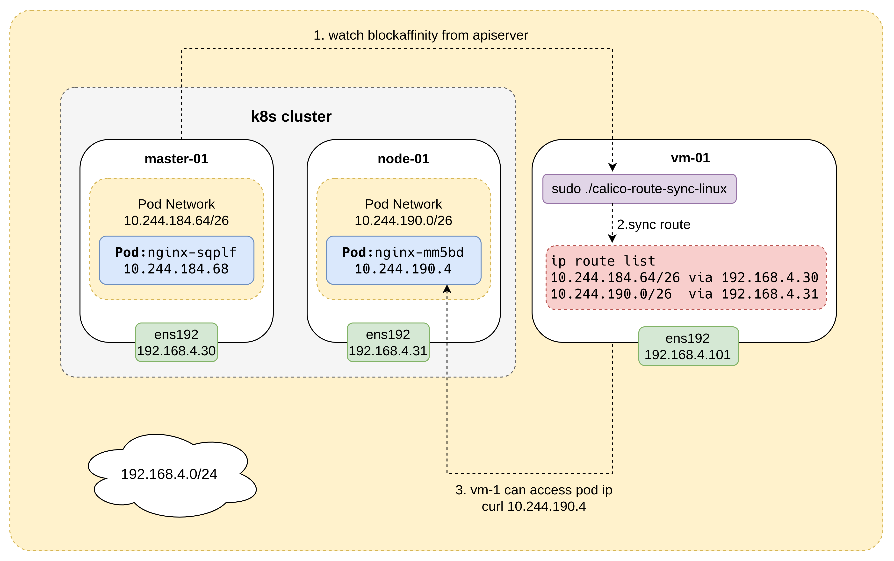

# calico-route-sync

### Introduction

synchronize calico routes



### Usage

bin：

```bash
sudo ./calico-route-sync --kubeconfig=/home/root/.kube/config
```

docker:

```bash
docker run --rm -it --network=host --cap-add NET_ADMIN -v ~/.kube/config:/root/config q946666800/calico-route-sync:0.1 --kubeconfig=/root/config
```

### Notice

The usage scenario is limited to only supporting Calico, and vm-01 is in the same network as the Kubernetes nodes.

The advantage is simplicity, efficiency, and stability (similar to Calico node). Traffic flows directly from vm-01 to the Kubernetes nodes without going through other routers or tunnels.

~~If you want vm-01 to be in a different network, you can use the project [k8s-tun](https://github.com/yzxiu/k8s-tun).~~

